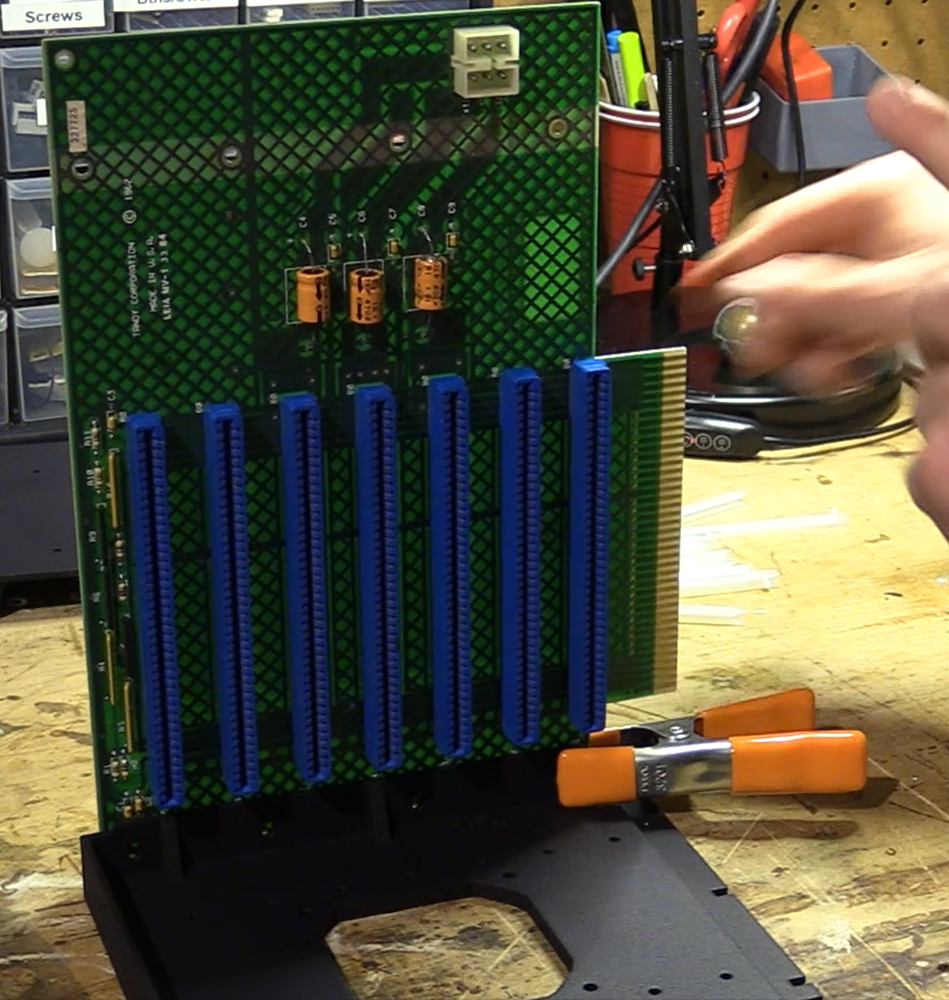

# Building the card cage

You'll need to print each of the three STL files here.  Each of the sides has its own STL file.  You'll need a printer with printable volume of at least 256x256x256.  I've successfully used the **Anycubic Kobra Plus** printer, as well as the **Bamnu Labs X1 Carbon**.  The following YouTube video documents the assembly in detail: https://youtu.be/dfIf2Al25_E.  The assembly section begins at 22:23.

## Tools
The following tools are recommended (beyond a 3D printer and filament, of course):

* A flat-head screw driver
* A philips head screw driver
* Clamps
* Wire strippers (14 and 16 AWG).

## Materials
The following materials are required:

* A seven-slot backplane for your TRS-80 Model 12.
* PLA or the material of your choice.  I've used PLA thus far with success.  I'm using: SUNLU 3D Printer Filament PLA, PLA Filament 1.75mm, Black PLA, Polylactic Acid.  You can find it on Amazon here: https://a.co/d/hkB7bHi
* PCB board guides (14 total; 7 per side).  I used DigiKey P/N **36-8623-ND** (made by Keystone Electronics, part #8623).  The guide holes in the cage are spaced for these particular guides.  This link was valid as of this writing: https://www.digikey.com/en/products/detail/keystone-electronics/8623/317060?s=N4IgTCBcDaIMwDYC0AOBY5IHIBEQF0BfIA
* M3 screws and matching nuts to attach the cage to the backplane.  The screw holes in these parts are sized with the major diameter of M3 screws in mind.  I used this 280-piece set from Amazon: https://a.co/d/1WeQXiK
* Optionally, threadlock to secure the screws and nuts.
* Six screws to attach the cage to the chassis of the system.  Metal is recommended here; you can re-use the screws currently holding the Model 12's existing metal housing, as you'll be removing it.

## PLA
Slice the STL files according to your material and printer and print them one-at-a-time.  I use Ultimaker Cura for this task.  The PLA I'm using is:

SUNLU 3D Printer Filament PLA, PLA Filament 1.75mm, Black PLA
You can find it on Amazon here: https://a.co/d/hkB7bHi

## Printer Settings
I use the following settings:

* Cura Profile: **Fine** (I start with this and then adjust the settings below.)
* Infill Density: 20%
* Infill pattern: triangle (grid also seems to work well)
* Print temp: My PLA has a range from 200-210 C, I print at 200 C.  Your temp will vary based on material.
* Print bed temp: 60 C (if your printer has a heated bed; will vary based on your material and bed type).
* The default orientation of the STL files should avoid the need to print supports.

If your printer is on the faster side (along the lines of the **Bambu Labs X1 Carbon**), it's recommended that your first layer speed be reduced to **30mm/s** or less.

## Post-Print Tweaks
After printing, you may find the screw holes may have material preventing you from inserting the screws; a stright pick should allow you to work the excess material out.  I routinely run the pick through each screw hole before attempting to assemble it to make life easier.  With higher quality materials and printers, this is less likely to be necessary.

## Assembly

* Snap the PCB card guides into the cage sides.  You may want to use glue or another adhesive, though I've found the DigiKey guides noted above snap in and reimain in place without glue.
* Attach the sides to your backplane using M3 screws and nuts.  Use clamps to hold the backplane to the cage while you thread the first couple of screws in each side.  **Do not fully tighten the screws.**  You'll note that the screws are smaller than the holes in the cage assembly; this is intended to allow you some wiggle room to adjust in case the width is a milimeter off in any direction.  This also helps to account for any variation in printing. 
* Attach the top, again with four M3 screw/nut pairs.  Again, **do not fully tighten the screws**.  
* Disassemble your Model 12, then disconnect and remove the video card from the computer.
* Test card fit by using the video card and attempting to insert it into each of the slots of the assembled card cage.  Loosen the screws/nuts where needed to adjust the alignment as-needed for best fit for all slots.  Tighten the screws when you're happy with the fit.   
* Remove and disassemble the existing metal cage holding the cooling fan from your Model 12.  Set the fan aside, along with its screws/nuts.  (See **Caveats** below). 
* Start the three screws on the left-hand side of the metal chassis.  These might be hard to start, so doing this before putting the cage in place will make things easier.  **Be sure you attach the factory ground lead to the middle screw.**  Ideally, when you install the top of the cage, the ground will be nestled between the left side of the cage and the metal chassis.  
* Install your power harness adapter/splitter.  **See the doc folder.**
* Attach the printed cage to the chassis and screw it in place, ensuring any factory grounds are installed between the metal chassis and the cage sides.  Use the screws you removed from the metal cage.  **You may find the metal doesn't line up perfectly;** my 16B looks as though it had been "tweaked" (bent) a bit to fit Tandy's card cage; use the screw holes to trim out as best as you can, and don't be afraid to adjust the chassis a bit.
* Make and run your grounding solution (providing spade terminals onto which the keyboard and video ground cables can be attached).  **See the doc folder.**
* Install the fan on the outside of the cage using the screws that you removed earlier.  Be sure the airflow is directed toward the back of the drives (so the fan pulls air through the cage, rather than pushing air into it).  
* Insert the video card and any other cards you have.
* Enjoy the feeling of running a non-neutered Model 12!

## Caveats And Considerations

Please note the following considerations, repeated from the main README:

* ****Grounding** You will need to provide grounding for the keyboard and video connectors.  The Tandy cage is metal, and contains spade connectors onto which you can attached the grounding leads.  You'll need to provide a way to ground these connectors.  Additionally, there are a couple of chassis ground leads that you'll need to make sure are attached as you install the card cage into your Model 12.  **See the doc folder for grounding instructions.**
* **Heat** For a setup with a one-three cards, the existing fan should suffice.  It's worth noting the Tandy card cage design did not allow for proper heat dissipation in the Models 12 and 16B; as a result, a modification often referred to as the **Turbo Fan Mod** became popular.  This was accomplished by cutting a large hole into the back cover of the system and attaching a 120V fan to the cover.  The fan was then wired to the AC line voltage at a terminal block by the power supply.  The system can easily overheat if you don't mitigate heat issues.  If you're planning to load up the expansion slots with cards, you should strongly consider doing the Turbo Fan Mod.  There is a 3D-printable rear panel replacement on Thingiverse (not my project).  It has space for two fans.  See: https://www.thingiverse.com/thing:5172782
* **Fit** Variataions in your printer, material, and the demensions of the system chassis and backplane may lead to situations where parts don't quite align perfectly.  As an example, the backplane in my Model 12 has a slight curve to it, and the metal chassis in the system is not perfectly straight.  I've tried to take this into account, but you may need to finagle things a bit or adjust hole sizes to fit your paritcular system.  Similarly, the chassis in my 12 was bent slightly outward in such a way that things didin't fit quite right.  My 16B, which has a factory-installed card cage, looked as though the chassis had been bent to fit the cage.  You may have to...adjust...things a bit for a best fit.  This is a situation where manufacturing variations may come into play...
* **Power** Your Model 12 may not have the additional harness needed to power the card cage.  My Model 12 is one of these systems.  As a result, you'll need to find a way to get +12, -12, and 5V to the cage along with their grounds.  **See the doc folder for materials and build instructions for the power harness.**