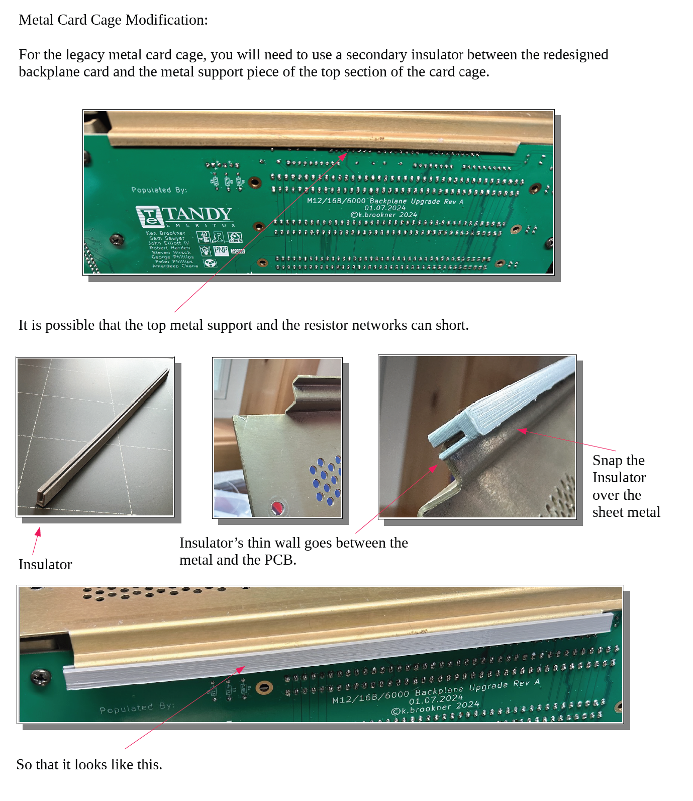

# Tandy Emeritus - Metal Cage Insulator

## About
If you're using the TE backplane with the original metal card cage included in the TRS-80 Models 12, 16B or the Tandy 6000, you'll need this insulator.  It prevents the solder joints for components on the backplane from contacting the overhang on the top of the Tandy card cage chassis.  **This part is not needed for the 3D-printed card cage hosted in this repo.**  

This part was designed by Tandy Emeritus and is hosted here for convenience.  Please contact TE with questions or support issues.

## Use

Please see the image below, taken from the TE documentation:

